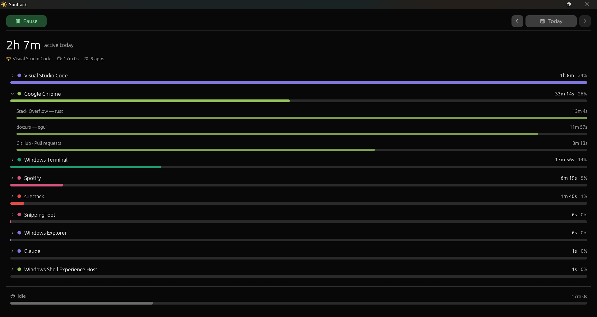
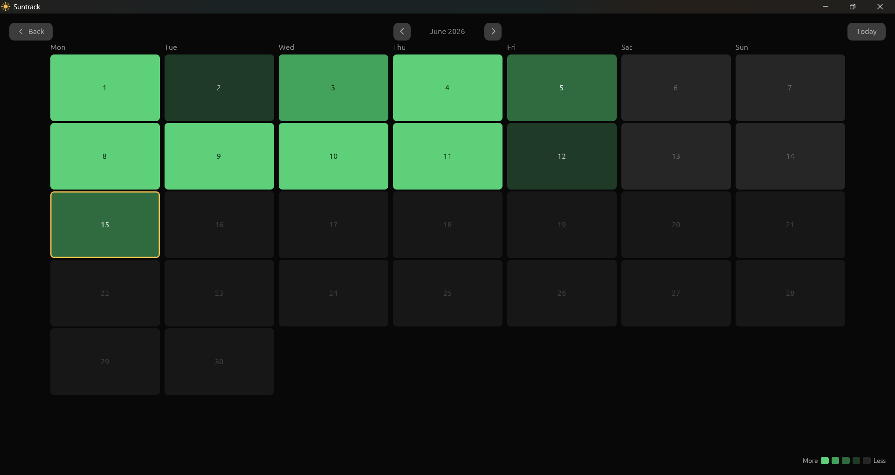
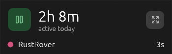

<div align="center">

# ☀️ Suntrack

**A lightweight desktop time tracker that quietly records where your day goes.**

Suntrack runs in the background, notices which app you're actually using, and turns
it into a clear picture of your day — without sending a single byte off your machine.

[](https://www.rust-lang.org/)
[](#installation)
[](https://github.com/emilk/egui)
[](#license)


</div>

## Overview

Suntrack is an **automatic** time tracker — you never have to start a stopwatch or label
what you're working on. Once it's running, a background thread samples your active window
every second, attributes the time to the app (and the specific window title) you're in,
and detects when you've stepped away so idle minutes don't get counted as work.

Everything lives in a single local SQLite database. There is no account, no cloud, and no
telemetry: your activity history never leaves your computer.

## Features

- **Automatic activity tracking** — records the active application and window title each
  second; no manual timers.
- **Idle detection** — time away from the keyboard past a configurable threshold is logged
  separately as *Idle* and kept out of your active totals.
- **App breakdown with drill-down** — a ranked dashboard of how long you spent in each app,
  expandable to the individual window titles within it.
- **Calendar heatmap** — a GitHub-style month view that shades each day by how much you
  tracked; click any day to revisit its full breakdown.
- **Always-on-top mini-HUD** — minimize the window and Suntrack collapses into a compact,
  draggable widget that snaps to the screen edge and shows your current app and running
  total at a glance.
- **Pause when you want** — one click stops tracking; the timeline stays accurate across
  pauses, system sleep, and midnight rollovers.
- **Local-first & private** — all data is stored in a local SQLite file. Nothing is uploaded.
- **Configurable** — sampling rate, idle threshold, and save interval are all set in a
  simple TOML file.

## Screenshots

<!-- Drop your screenshots into a `docs/` folder with these names and they'll render below. -->

<div align="center">



<sub>**Dashboard** — your day at a glance, ranked by app with a per-window-title drill-down.</sub>

<br><br>



<sub>**Calendar** — a month heatmap shaded by how much you tracked; click any day to revisit it.</sub>

<br><br>



<sub>**Mini-HUD** — the always-on-top widget that stays out of the way while you work.</sub>

</div>

## Installation

Suntrack targets **Windows** and ships as a single self-contained executable — there's no
installer to run.

1. Download the latest **`suntrack.exe`** from the [Releases page](https://github.com/FarizPrawira/suntrack/releases).
2. Move it to a permanent location — for example, a `Suntrack` folder within your user
   directory — and run it. Optionally, pin it to the taskbar for quick access.
3. On first launch, Suntrack creates its data directory at `%LOCALAPPDATA%\suntrack` and
   begins tracking immediately.

> **Note:** because the binary isn't code-signed, Windows SmartScreen may show a warning the
> first time you run it. Click **More info → Run anyway** to continue.

<details>
<summary><strong>Build from source</strong></summary>

Suntrack builds with the standard Rust toolchain. You'll need
[Rust](https://rustup.rs/) 1.85 or newer (the project uses the 2024 edition).

```sh
git clone https://github.com/FarizPrawira/suntrack.git
cd suntrack
cargo run --release
```

The optimized binary is produced at `target\release\suntrack.exe`.

</details>

## Usage

- **Dashboard** — opens on the current day. The big number is your total active time; the
  list below ranks your apps. Click any row to expand its per-window-title breakdown.
- **Pause / resume** — the toggle in the top-left stops and starts tracking.
- **Browse history** — use the day arrows, or click the date to open the **calendar** and
  jump to any past day.
- **Mini-HUD** — minimize the window to collapse Suntrack into the always-on-top HUD. Drag
  it anywhere (it snaps to the nearest edge), or right-click it to reopen the full window or
  quit. Click the expand icon to restore the dashboard.

## Configuration

On first launch, Suntrack writes a self-documenting config file you can edit and restart to
apply. Both the database and config live in your per-user data directory:

```
%LOCALAPPDATA%\suntrack\config.toml   # settings
%LOCALAPPDATA%\suntrack\usage.db      # tracked activity
```

| Setting | Default | Description |
|---|---|---|
| `idle_timeout_secs` | `60` | Seconds of inactivity before time is logged as *Idle*. |
| `save_interval_secs` | `15` | How often accumulated time is written to the database. |
| `refresh_rate_secs` | `1` | Tracker sampling interval. Lower is more responsive, slightly more CPU. |

Missing fields fall back to their defaults, and a malformed file is ignored with a warning
rather than stopping the app.

## Tech stack

- **[Rust](https://www.rust-lang.org/)** (2024 edition)
- **[eframe / egui](https://github.com/emilk/egui)** — immediate-mode GUI
- **[rusqlite](https://github.com/rusqlite/rusqlite)** — bundled SQLite storage
- **[active-win-pos-rs](https://github.com/dimusic/active-win-pos-rs)** — active window detection
- **[user-idle](https://crates.io/crates/user-idle)** — idle-time detection
- **[chrono](https://github.com/chronotope/chrono)** — date/time handling
- **[egui-phosphor](https://github.com/amPerl/egui-phosphor)** — icon font
- **[serde](https://serde.rs/) + [toml](https://github.com/toml-rs/toml)** — config

## Contributing

Issues and pull requests are welcome. For larger changes, please open an issue first to
discuss what you'd like to change.

## License

Released under the [MIT License](LICENSE).
